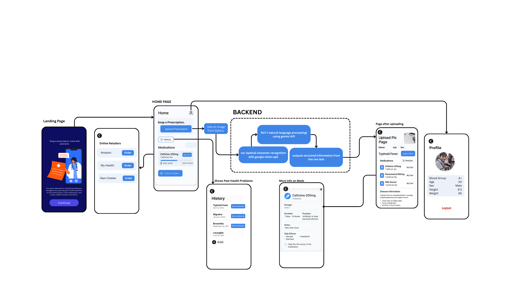

## 🔎 Project Overview

**MediSnap** is a prescription parsing system designed to extract structured medical information from **handwritten doctor prescriptions**. The core objective of this system is to make medical prescriptions more **readable, structured, and accessible** by automatically identifying and categorizing essential medical details.

### 📋 Information Extracted

- **Patient Information** (Name, Age, Gender)
- **Doctor Details**
- **Date of Prescription**
- **Diagnoses / Medical Conditions**
- **Medications** (Name, Dosage, Duration)
- **Precautions & Warnings**
- **Reminders and Follow-up Notes**

The system processes handwritten prescription images using **OCR (Optical Character Recognition)**, applies **NLP techniques** to extract relevant entities, and generates a **structured JSON output** containing all the extracted data.

---

## 📐 System Architecture

  

---

## ⚙️ Workflow

### 1️⃣ Input Upload  
The user uploads a handwritten prescription image through the application interface.

### 2️⃣ OCR Processing  
The uploaded image is processed using OCR to extract raw text from handwritten content.

### 3️⃣ Entity Extraction  
NLP techniques are applied to identify and extract relevant entities such as:
- Patient details  
- Doctor information  
- Medications  
- Dosage and duration  
- Precautions and reminders  

### 4️⃣ Data Structuring  
The extracted information is organized into a **well-defined JSON schema** for easy interpretation and further use.

### 5️⃣ Output Generation  
The structured JSON data is displayed in a **clean, readable format** on the user interface.
